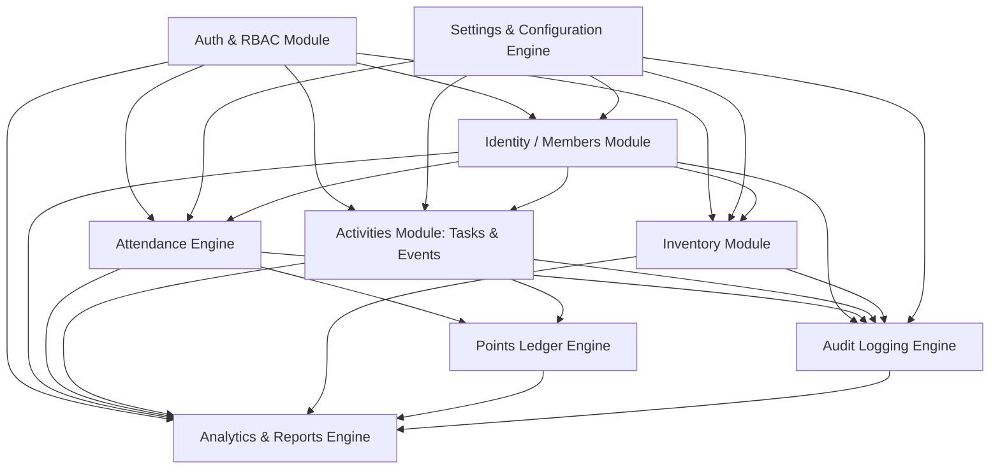

# RCMS Master Knowledge Map

Version: 1.0.0  
Status: Active — Verified against Complete Documentation Suite  
Author: Senior Software Engineer (Antigravity)  
Approved By: RCMS CTO  

---

# 1. Project Overview

The **Robotics Club Management System (RCMS)** is an integrated internal management platform built specifically for academic robotics clubs (initially SAC Robotics Club). RCMS automates member lifecycle management, attendance tracking via secure QR codes, task/event participation tracking, an immutable points ledger and dynamic leaderboard, component/equipment inventory borrowing, role-based administration, and audit analytics.

### Architecture Core Philosophy
- **Domain-Driven Architecture:** Code and database schemas organized around core business domains, not individual UI screens.
- **Single Source of Truth:** Documentation governs implementation. Code never dictates business rules.
- **Vertical Slice Architecture:** `Page UI` $\rightarrow$ `REST API Route` $\rightarrow$ `Domain Service Layer` $\rightarrow$ `Repository Layer` $\rightarrow$ `Database (PostgreSQL via Drizzle ORM)`.
- **Immutable Financial-Grade Ledger:** Points are transactions recorded in an immutable ledger. Direct edits to point balances are strictly prohibited.
- **Soft Deletes & Total Auditing:** No permanent deletion of business data; every sensitive state change creates an immutable audit trail.
- **Configuration over Hardcoding:** Dynamic settings engine controls operational parameters (attendance points, late thresholds, semester dates).

---

# 2. Engineering Modules

## 2.1 Identity / Members Module
- **Purpose:** Manages member identity, profiles, registration, CSV batch imports, academic year/semester affiliations, and QR card generation.
- **Source Documents:** Volume 2, Volume 3A, Volume 4A, Volume 5B, Volume 6, Volume 7, Volume 8.
- **Dependencies:** Configuration / Settings Engine, Shared UI Components.
- **Database Tables:** `members`, `memberships`, `academic_years`, `semesters`.
- **Services:** `MemberService`, `MembershipService`, `QrGeneratorService`, `CsvImportService`.
- **API Endpoints:** `GET /api/members`, `POST /api/members`, `GET /api/members/{id}`, `PUT /api/members/{id}`, `DELETE /api/members/{id}`, `POST /api/members/import`.
- **UI Screens:** Members List, Add Member Form, Member Profile Tabs, CSV Import Wizard, QR Card Generator.
- **Business Rules:** Member IDs are permanent and immutable. Roll Numbers must be unique. Members cannot be hard deleted. Renewal creates a new `membership` record per academic period while preserving `member_id`.
- **Related Modules:** Attendance Module, Activities Module, Inventory Module.

## 2.2 Attendance Module
- **Purpose:** Handles session creation, QR camera scanning, volunteer code authorization, live monitoring, late thresholds, and attendance reports.
- **Source Documents:** Volume 2, Volume 3B, Volume 4A, Volume 5C, Volume 6, Volume 7, Volume 8, Volume 9, Volume 14.
- **Dependencies:** Members Module, Points Ledger, Volunteer Security, Settings Engine.
- **Database Tables:** `attendance_sessions`, `attendance_records`, `volunteer_codes`.
- **Services:** `AttendanceService`, `ScanVerificationService`, `VolunteerCodeService`.
- **API Endpoints:** `POST /api/attendance/sessions`, `POST /api/attendance/scan`, `POST /api/attendance/sessions/{id}/close`, `GET /api/attendance/reports`.
- **UI Screens:** Attendance Dashboard, Create Session, Live Monitor, Scanner Interface, Volunteer Code Manager, Manual Attendance Dialog, Session Summary.
- **Business Rules:** One scan per member per session. Scans require active session and valid volunteer code. Late status calculated dynamically via session threshold. Every valid scan automatically posts an entry to the Points Ledger.
- **Related Modules:** Members Module, Points Ledger, Security / RBAC.

## 2.3 Activities Module (Tasks, Events, Points, Leaderboard)
- **Purpose:** Manages project/club tasks, event organization, member participation, transaction-based points accounting, and real-time rank computation.
- **Source Documents:** Volume 3C, Volume 4A, Volume 5D, Volume 6, Volume 7, Volume 8, Volume 9.
- **Dependencies:** Members Module, Points Ledger, Shared Component Library.
- **Database Tables:** `tasks`, `task_completions`, `events`, `event_participations`, `points_ledger`.
- **Services:** `TaskService`, `EventService`, `PointsLedgerService`, `LeaderboardService`.
- **API Endpoints:** `POST /api/tasks`, `POST /api/tasks/{id}/complete`, `POST /api/events`, `POST /api/events/{id}/participate`, `GET /api/points/ledger`, `GET /api/points/leaderboard`.
- **UI Screens:** Activities Dashboard, Task List & Form, Event List & Form, Points Ledger View, Dynamic Leaderboard, Activity Timeline.
- **Business Rules:** Member points cannot be directly updated; all point adjustments require a new transaction in `points_ledger`. Tasks/Events award points once per member unless configured. Leaderboard ranks by highest semester points with tie-breakers (earliest points earned $\rightarrow$ earliest join date).
- **Related Modules:** Members Module, Attendance Module, Audit Module.

## 2.4 Inventory Module
- **Purpose:** Tracks robotics lab components, tools, kits, stock levels, equipment borrowing workflows, return condition inspection, and overdue tracking.
- **Source Documents:** Volume 3C, Volume 4A, Volume 5E, Volume 6, Volume 7, Volume 8, Volume 9.
- **Dependencies:** Members Module, Audit Engine, Shared Dialogs.
- **Database Tables:** `inventory_items`, `inventory_borrowings`.
- **Services:** `InventoryService`, `BorrowingService`.
- **API Endpoints:** `GET /api/inventory`, `POST /api/inventory/{id}/borrow`, `POST /api/inventory/{id}/return`.
- **UI Screens:** Inventory Dashboard, Item Management List, Borrow Item Dialog, Return Item Dialog with Condition Rating.
- **Business Rules:** Available quantity cannot drop below zero. Return quantity cannot exceed borrowed quantity. Borrowing history is immutable. Items returned damaged or lost record explicit audit logs.
- **Related Modules:** Members Module, Audit Module.

## 2.5 Administration & Security Module
- **Purpose:** Controls administrative users, role-based permissions (RBAC), audit logging, global configuration, backups, and maintenance routines.
- **Source Documents:** Volume 3D, Volume 4A, Volume 4B, Volume 5E, Volume 6, Volume 7, Volume 8, Volume 10, Volume 13, Volume 23.
- **Dependencies:** Supabase Auth, Storage Provider.
- **Database Tables:** `users`, `roles`, `permissions`, `role_permissions`, `audit_logs`, `system_settings`.
- **Services:** `AuthService`, `RbacService`, `AuditService`, `SettingsService`.
- **API Endpoints:** `POST /api/auth/login`, `POST /api/auth/logout`, `POST /api/auth/refresh`, `GET /api/settings`, `PUT /api/settings/{key}`, `GET /api/reports/{type}`.
- **UI Screens:** Admin Dashboard, User Management, Role & Permission Matrix, System Settings Tabs, Audit Logs Viewer, Backup & Export Panel.
- **Business Rules:** Super Admin possesses non-revocable root access. Every protected API action enforces server-side permission validation. Audit logs are append-only and cannot be altered or deleted.
- **Related Modules:** All Modules.

## 2.6 Analytics & Reports Engine
- **Purpose:** Consolidates cross-modular data into executive dashboards, branch statistics, attendance trends, engagement charts, and CSV exports.
- **Source Documents:** Volume 3D, Volume 4A, Volume 5A, Volume 5E, Volume 7, Volume 24.
- **Dependencies:** Members, Attendance, Activities, Inventory, Audit.
- **Database Tables:** Read-only aggregation over all domain tables.
- **Services:** `AnalyticsService`, `ReportExportService`.
- **API Endpoints:** `GET /api/reports/{type}`, `GET /api/points/leaderboard`.
- **UI Screens:** Executive Command Center Dashboard, Custom Reports Page, System Diagnostics.
- **Business Rules:** Analytical figures (attendance percentages, leaderboard rankings) are derived dynamically from transactional tables to guarantee data consistency.
- **Related Modules:** All Modules.

---

# 3. Dependency Graph



---

# 4. Document Cross References

| Feature / Domain | Primary PRD / Architecture Spec | UI Spec | Database & API Spec | Governance & Standard |
| :--- | :--- | :--- | :--- | :--- |
| **System Philosophy & Architecture** | RCMS_00, Vol 1, Vol 4D | Vol 5A | Vol 4A, Vol 4B | Vol 18 (Constitution), Manifest |
| **Identity & Member Management** | Vol 2, Vol 3A | Vol 5B | Vol 4A, Vol 6, Vol 7 | Vol 8 (Rules), Vol 23 (Governance) |
| **Attendance & Scanning** | Vol 2, Vol 3B | Vol 5C | Vol 4A, Vol 6, Vol 7 | Vol 8 (Rules), Vol 9, Vol 14 (Volunteer) |
| **Tasks & Events** | Vol 3C | Vol 5D | Vol 4A, Vol 6, Vol 7 | Vol 8 (Rules), Vol 9 (States) |
| **Points Ledger & Leaderboard** | Vol 2, Vol 3C | Vol 5D | Vol 4A, Vol 6, Vol 7 | Vol 8 (Rules), Vol 18 (Constitution) |
| **Inventory & Borrowing** | Vol 3C | Vol 5E | Vol 4A, Vol 6, Vol 7 | Vol 8 (Rules), Vol 9 (States) |
| **RBAC, Users & Authentication** | Vol 3D, Vol 10 | Vol 5E | Vol 4A, Vol 6, Vol 7 | Vol 8 (Rules), Vol 10 (Security) |
| **System Settings Engine** | Vol 3D, Vol 4A | Vol 5E | Vol 4A, Vol 6, Vol 7 | Vol 8 (Rules), Guardrails |
| **Audit Logs & Security** | Vol 3D, Vol 10 | Vol 5E | Vol 4A, Vol 6, Vol 7 | Vol 8, Vol 10, Vol 23 |
| **Testing & Quality Assurance** | Vol 11, Vol 15 | - | - | Vol 11 (Strategy), Quality Gates |
| **Deployment & Infrastructure** | Vol 12 | - | Vol 4D | Vol 12 (Deployment Manual) |

---

# 5. Implementation Order

```
[Phase 0: Governance & Environment Setup]
       │
       ▼
[Phase 1: Database Schema & Migration Layer] ── (Tables, Constraints, Drizzle ORM Setup)
       │
       ▼
[Phase 2: Authentication & RBAC Engine] ──────── (Supabase Auth, Roles, Permissions Middleware)
       │
       ▼
[Phase 3: Settings & Configuration Engine] ───── (System Settings Table & Service Layer)
       │
       ▼
[Phase 4: Identity & Members Module] ────────── (Member & Membership Services, CSV Import, QR Gen)
       │
       ▼
[Phase 5: Attendance Engine] ───────────────── (Session Mgmt, Volunteer Codes, QR Scanner API)
       │
       ▼
[Phase 6: Activities Module & Points Ledger] ─ (Tasks, Events, Immutable Ledger, Dynamic Leaderboard)
       │
       ▼
[Phase 7: Inventory Module] ────────────────── (Component Tracking, Borrowing & Return Workflows)
       │
       ▼
[Phase 8: Reports, Audit & Analytics] ──────── (Audit Logs, CSV/PDF Reports, Executive Dashboard)
       │
       ▼
[Phase 9: Performance Optimization & Polish] ── (Indexes, Skeleton Loaders, E2E QA Verification)
       │
       ▼
[Phase 10: Production Deployment] ──────────── (Vercel Build, Supabase Migrations, CI/CD Pipeline)
```

---

# 6. Shared Systems

1. **Authentication:** Supabase Auth providing JWT sessions, HTTP-only secure cookies, password hashing, and configurable session expiration (default 30 min).
2. **Role-Based Access Control (RBAC):** Server-side permission checks attached to API routes and UI components (`Users` $\rightarrow$ `Roles` $\rightarrow$ `Permissions`).
3. **Settings Engine:** `system_settings` key-value table acting as the single source of truth for business configuration parameters without redeploying code.
4. **Audit Logging Engine:** Append-only transaction log (`audit_logs`) recording `user_id`, `module`, `action`, `old_value`, `new_value`, `ip`, and browser details for all sensitive operations.
5. **Points Ledger Engine:** Transactional ledger (`points_ledger`) capturing all point additions/deductions with reference types (`Attendance`, `Task`, `Event`, `Bonus`, `Adjustment`).
6. **Search Service:** Global search provider querying across Member Name, Roll Number, Member ID, and Phone number.
7. **Notification System:** Standardized toast notification system for success, error, and system warnings with accessible aria attributes.
8. **Configuration System:** Standardized environment variable management for API keys, Supabase credentials, and environment flags.

---

# 7. Database Reference Map

| Table Name | Description | Key Columns | Primary Owner Module |
| :--- | :--- | :--- | :--- |
| `academic_years` | Academic year definitions | `id`, `name`, `start_date`, `end_date`, `status` | Identity / Settings |
| `semesters` | Semester terms per academic year | `id`, `academic_year_id`, `name`, `start_date`, `end_date`, `status` | Identity / Settings |
| `members` | Permanent member identity | `id` (UUID), `member_id` (UNIQUE), `roll_number` (UNIQUE), `name`, `email`, `phone`, `status`, `deleted_at` | Identity / Members |
| `memberships` | Semester-specific member state | `id`, `member_id`, `academic_year_id`, `semester_id`, `status` | Identity / Members |
| `users` | Administrative staff logins | `id`, `name`, `email`, `password_hash`, `role_id`, `status`, `last_login` | Administration / Auth |
| `roles` | RBAC role definitions | `id`, `name`, `description` | Administration / Security |
| `permissions` | Granular action permissions | `id`, `module`, `action` | Administration / Security |
| `role_permissions` | Role to permission mapping | `role_id`, `permission_id` | Administration / Security |
| `attendance_sessions` | Attendance session metadata | `id`, `title`, `date`, `start_time`, `end_time`, `attendance_points`, `late_threshold`, `status` | Attendance Engine |
| `volunteer_codes` | Scanner access passcodes | `id`, `session_id`, `code`, `status`, `expires_at`, `activated_by` | Attendance / Security |
| `attendance_records` | Individual attendance scans | `id`, `member_id`, `session_id`, `scan_time`, `points`, `late`, `volunteer_user` | Attendance Engine |
| `tasks` | Club activities / tasks | `id`, `title`, `description`, `points`, `status`, `created_by` | Activities Module |
| `task_completions` | Task completion logs | `id`, `task_id`, `member_id`, `completed_by`, `completed_at` | Activities Module |
| `events` | Organized club events | `id`, `name`, `description`, `venue`, `start_date`, `end_date`, `points`, `status` | Activities Module |
| `event_participations` | Event attendance logs | `id`, `event_id`, `member_id`, `verified_by` | Activities Module |
| `points_ledger` | Immutable points ledger | `id`, `member_id`, `category`, `reference_type`, `reference_id`, `points`, `created_by`, `created_at` | Activities / Points Engine |
| `inventory_items` | Lab items & equipment | `id`, `name`, `category`, `quantity`, `available`, `condition`, `deleted_at` | Inventory Module |
| `inventory_borrowings` | Borrowing transaction records | `id`, `inventory_id`, `member_id`, `quantity`, `issue_date`, `return_date`, `status`, `issued_by` | Inventory Module |
| `audit_logs` | Immutable audit records | `id`, `user_id`, `module`, `action`, `old_value`, `new_value`, `created_at`, `ip` | Administration / Audit |
| `system_settings` | Configuration settings | `key` (PK), `value`, `description`, `updated_at` | Administration / Settings |

---

# 8. API Reference Map

### Authentication & User Management
- `POST /api/auth/login` — Authenticate user and issue session token.
- `POST /api/auth/logout` — Terminate session token.
- `POST /api/auth/refresh` — Refresh authentication JWT.

### Members Module
- `GET /api/members` — Search and list members with pagination & filters.
- `POST /api/members` — Register a new member.
- `GET /api/members/{id}` — Fetch complete member profile and history.
- `PUT /api/members/{id}` — Update member personal/academic details.
- `DELETE /api/members/{id}` — Soft delete a member.
- `POST /api/members/import` — Batch import members via CSV parser.

### Attendance Module
- `POST /api/attendance/sessions` — Create a new attendance session.
- `POST /api/attendance/scan` — Process QR scan and record attendance.
- `POST /api/attendance/sessions/{id}/close` — Close an active attendance session.
- `GET /api/attendance/reports` — Fetch attendance session summary reports.

### Activities & Points Engine
- `POST /api/tasks` — Create a new task.
- `POST /api/tasks/{id}/complete` — Record member task completion and award points.
- `POST /api/events` — Create a new club event.
- `POST /api/events/{id}/participate` — Record event participation and award points.
- `GET /api/points/ledger` — Fetch immutable points ledger history.
- `GET /api/points/leaderboard` — Fetch dynamic semester/lifetime member leaderboard.

### Inventory Module
- `GET /api/inventory` — List equipment items, stock levels, and status.
- `POST /api/inventory/{id}/borrow` — Issue an inventory item to a member.
- `POST /api/inventory/{id}/return` — Record item return and assess condition.

### Reports & Administration
- `GET /api/reports/{type}` — Generate analytical data reports (CSV export).
- `GET /api/settings` — Fetch system configuration parameters.
- `PUT /api/settings/{key}` — Update system configuration value.

---

# 9. UI Reference Map

### Dashboard
- **Executive Command Center:** Key statistics, active attendance status, leaderboard preview, activity feed, upcoming events.

### Members Module
- **Members List:** Searchable table, filtering by branch/year/status, bulk actions, CSV export.
- **Add Member:** Two-column validated form for personal, academic, and contact details.
- **Member Profile:** Contextual view containing Overview, Attendance history, Points ledger, Tasks, Events, and Borrowings tabs.
- **CSV Import Wizard:** 4-step wizard (Upload $\rightarrow$ Header Match $\rightarrow$ Validation Preview $\rightarrow$ Execution).
- **QR Card Generator:** Batch preview and print/export layout for member ID cards.

### Attendance Module
- **Attendance Dashboard:** Overview of sessions, weekly/semester averages, session creation trigger.
- **Create Session Form:** Configures session details, point values, late threshold minutes, and late points penalty.
- **Live Attendance Monitor:** Real-time stream of scans, attendance timer, present/late stats, volunteer codes control.
- **QR Scanner View:** Full-screen camera scanner interface with instant feedback cards.
- **Volunteer Code Manager:** Active volunteer passcodes, expiration timers, revocation options.

### Activities Module
- **Task Management List & Form:** Task status boards, creation dialogs, member completion assignment.
- **Event Management List & Form:** Event details, venue scheduling, participant verification.
- **Points Ledger Table:** Detailed transaction grid with filters for member, activity category, and date.
- **Leaderboard View:** Top 10 podium, full rank listing, semester/academic year filter, trend indicators.

### Administration & Settings
- **User & Role Management:** Staff user table, role assignment, granular permission checkboxes matrix.
- **System Settings Screen:** Tabbed settings interface (General, Academic, Attendance, Inventory, System).
- **Audit Log Viewer:** Filterable log grid with detail view displaying before/after JSON diffs.
- **Backup & Utilities:** Data export tools and diagnostic execution buttons.

---

# 10. Business Rule Reference Map

| Rule ID | Rule Summary | Source Document | Target Module |
| :--- | :--- | :--- | :--- |
| **BR-MEM-001** | Member IDs and Roll Numbers are permanent, unique, and immutable. | Volume 8, Ch 1 | Identity / Members |
| **BR-MEM-002** | Members cannot be hard deleted; status changes to Inactive/Alumni or soft-deleted. | Volume 8, Ch 1; Guardrails | Identity / Members |
| **BR-MEM-003** | Academic year transition resets member status to Inactive until renewed. | Volume 8, Ch 9 | Identity / Members |
| **BR-ATT-001** | Exactly one attendance record allowed per member per session. | Volume 8, Ch 2 | Attendance Engine |
| **BR-ATT-002** | Scans require an active session and valid unexpired volunteer code. | Volume 8, Ch 2; Vol 10 | Attendance Engine |
| **BR-ATT-003** | Late attendance awards reduced points based on configurable threshold. | Volume 8, Ch 2; Vol 4A | Attendance Engine |
| **BR-PTS-001** | Points are strictly transactional; direct balance editing is prohibited. | Volume 8, Ch 3; Guardrails | Points Ledger |
| **BR-PTS-002** | Point balance is dynamically calculated as $\sum (\text{points\_ledger})$. | Volume 8, Ch 3; Vol 4A | Points Ledger |
| **BR-PTS-003** | Point adjustments require explicit administrator reasoning and audit logging. | Volume 8, Ch 3; Vol 10 | Points Ledger / Audit |
| **BR-LDB-001** | Leaderboard rank tie-breaking: Points $\rightarrow$ Earliest Earned $\rightarrow$ Join Date. | Volume 8, Ch 7 | Leaderboard |
| **BR-INV-001** | Available stock cannot drop below zero; return quantity $\le$ borrowed quantity. | Volume 8, Ch 6 | Inventory Module |
| **BR-SEC-001** | All protected actions validate permissions on the server side via RBAC. | Volume 8, Ch 8; Vol 10 | Security / Auth |
| **BR-AUD-001** | Audit log entries are append-only and cannot be modified or deleted. | Volume 8, Ch 10; Vol 10 | Audit Engine |

---

# 11. State Machine Reference Map

```
1. Member Lifecycle State Machine:
   [Active] ──(Semester End)──> [Inactive] ──(Renewal)──> [Active]
      │                            │
      ├──(Suspension)──────────────┴──(Graduation)──> [Alumni]
      ▼
   [Suspended] ──(Admin Reinstatement)──> [Active]

2. Attendance Session State Machine:
   [Draft] ──(Schedule)──> [Scheduled] ──(Start)──> [Active] ──(Pause)──> [Paused]
                                                      │                      │
                                                    (Close)               (Resume)
                                                      ▼                      │
                                                   [Closed] <────────────────┘
                                                      │
                                                  (Archive)
                                                      ▼
                                                   [Archived]

3. Task Lifecycle State Machine:
   [Draft] ──(Publish)──> [Active] ──(Mark Complete)──> [Completed] ──(Archive)──> [Archived]

4. Event Lifecycle State Machine:
   [Upcoming] ──(Event Start)──> [Active] ──(Finish)──> [Completed] ──(Archive)──> [Archived]
                                    │
                                (Cancel)
                                    ▼
                                [Cancelled]

5. Inventory Borrowing State Machine:
   [Available] ──(Issue Item)──> [Borrowed] ──(Return On Time)──> [Returned]
                                     │
                               (Past Due Date)
                                     ▼
                                 [Overdue] ──(Return Late)──> [Returned]

6. Volunteer Code State Machine:
   [Unused] ──(Activate)──> [Active] ──(Timer Expired / Revoked)──> [Expired / Revoked]
```

---

# 12. Testing Reference Map

- **Unit Testing (70% Target Coverage):** Focuses on core domain logic in isolation.
  - Member ID format generation logic.
  - Late attendance timestamp vs. threshold calculation.
  - Dynamic points summation from transactional ledger rows.
  - Granular RBAC permission check evaluation functions.
  - CSV header and data validation rules.
- **Integration Testing (20% Target Coverage):** Tests multi-component service interaction.
  - Attendance scan $\rightarrow$ Attendance Record $\rightarrow$ Points Ledger entry $\rightarrow$ Leaderboard recalculation.
  - Task completion $\rightarrow$ Points Ledger transaction $\rightarrow$ Audit Log write.
  - Inventory borrow $\rightarrow$ Item stock deduction $\rightarrow$ Borrow record creation.
- **End-to-End (E2E) Testing (10% Target Coverage):** End-to-end critical user journeys.
  - Full member registration, CSV batch import, and profile rendering flow.
  - Attendance session lifecycle: creation $\rightarrow$ volunteer code generation $\rightarrow$ camera scan $\rightarrow$ session closure summary.
  - Inventory issue and return cycle with condition audit.

---

# 13. Security Reference Map

1. **Authentication:** Supabase Auth enforcing JWT tokens in HTTP-only, secure cookies with 30-minute inactivity expiration timeouts.
2. **Authorization:** Server-side RBAC middleware validating role permissions (`module:action`) on every API request.
3. **Data Protection:**
   - Soft deletes on business entities (`deleted_at`).
   - Server-side input validation via Zod schemas.
   - ORM prepared statements (Drizzle) preventing SQL injection.
   - HTML escaping via React preventing XSS.
   - Secure CSRF token validation on state-modifying POST/PUT/DELETE requests.
4. **QR Security:** QR payloads store UUID and encrypted validation token; zero personal identifiable information (PII) embedded in raw QR codes.
5. **Volunteer Security:** Alphanumeric volunteer access passcodes valid for max 1 hour, single browser session activation, instantly revocable by admin.
6. **Audit Trail:** Mandatory append-only logging of user actions, IP addresses, user agents, and before/after state diffs.

---

# 14. Deployment Reference Map

- **Infrastructure:**
  - Frontend & Backend API Routes: Hosted on **Vercel** serverless platform.
  - Database & Auth: Managed **Supabase PostgreSQL** instance with automated daily snapshots.
  - File Storage: **Supabase Storage** bucket for member photos and document exports.
- **Environments:**
  - **Development:** Local developer environment with local Supabase emulator.
  - **Staging:** Vercel preview deployment connected to staging database for pull-request verification.
  - **Production:** Vercel production environment connected to primary PostgreSQL instance.
- **Release Strategy:** Automated CI/CD via GitHub Actions. Push to `main` executes unit/integration test suites, builds application artifacts, applies database migrations, and deploys to production upon approval.
- **Rollback Strategy:** Database schema migrations are structured to be backwards compatible; application rollbacks executed via Vercel instant deployment rollback.

---

# 15. Future Modules (Postponed Scope)

The following modules and features are explicitly designated for future releases (v2.0 / v3.0) and are **strictly excluded** from the Version 1.0 implementation scope per Volume 16 (Roadmap):

- **v2.0 Extensions:**
  - Club Gallery & Media Hub
  - Automated PDF Certificate Generator
  - Member Self-Service Event Registration
  - Inventory QR Code Label Printing
  - Automated Google Drive Database Backups
  - Advanced Machine Learning Analytics
  - Public Mobile App API Endpoints
  - Multi-Channel Notification Engine (SMS / WhatsApp / Email Push)
- **v3.0 Ecosystem:**
  - Dedicated Member & Alumni Portals
  - Student Project & Portfolio Showcase
  - Sponsor & Grant Management Module
  - Financial & Budget Management System
  - Multi-Club Platform Support (Multi-tenant)

---

# END OF FILE